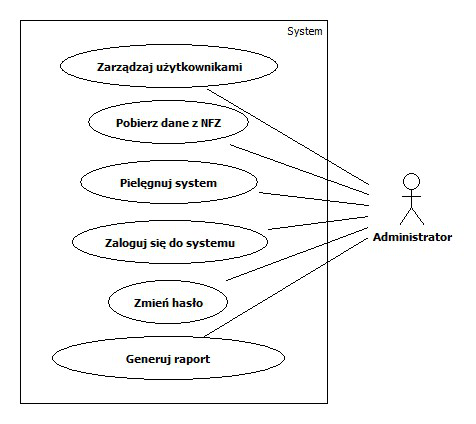
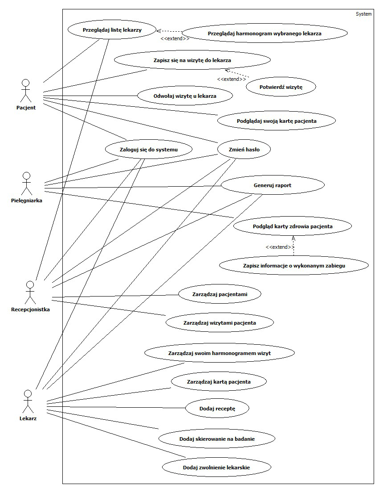
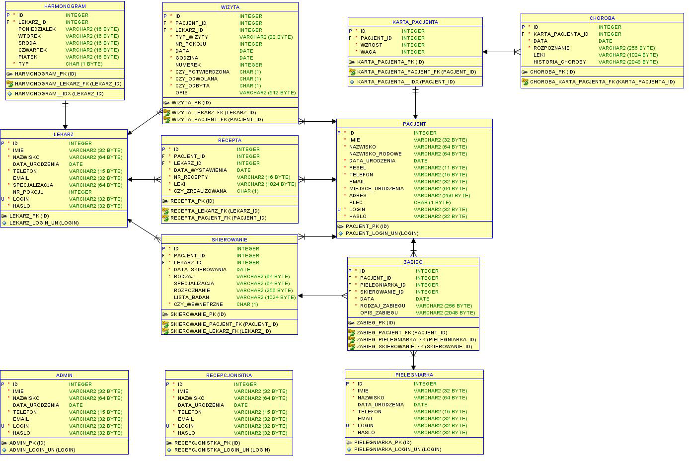
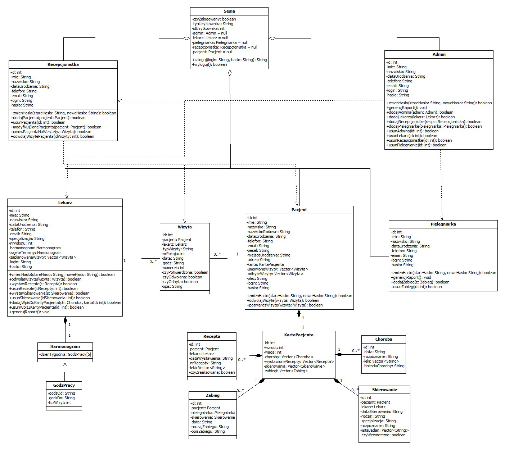

# MedicalClinic #

## Opis ##

Projekt _MedicalClinic_ powstał na potrzeby pracy licencjackiej pt. "System obsługi pacjenta w przychodni lekarskiej". Założeniem pracy było stworzenie projektu zgodnie z metodyką _RUP_ (Rational Unified Process).

Jest to aplikacja posiadająca graficzny interfejs użytkownika (GUI). Został on opracowany przy pomocy biblioteki Java Swing. System działa w architekturze klient-serwer. Serwerem jest serwer bazy danych Oracle 11g, przechowujący wszystkie dane systemu.

## Użytkownicy ##

Istnieje 5 typów użytkowników wyszczególnionych w poniższych diagramach przypadków użycia. Każdy z typów użytkowników posiada indywidualne konto z odrębnionymi funkcjonalnościami zależnymi od typu konta.

## Schemat bazy danych ##

## Diagram klas ##

## Uruchamianie ##

Do uruchomienia systemu potrzebna jest baza Oracle 11g. Skrypty do tworzenia urzytkowników i tabel bazy znajdują się w katalogu [docs/sql_scripts](./docs/sql_scripts)
